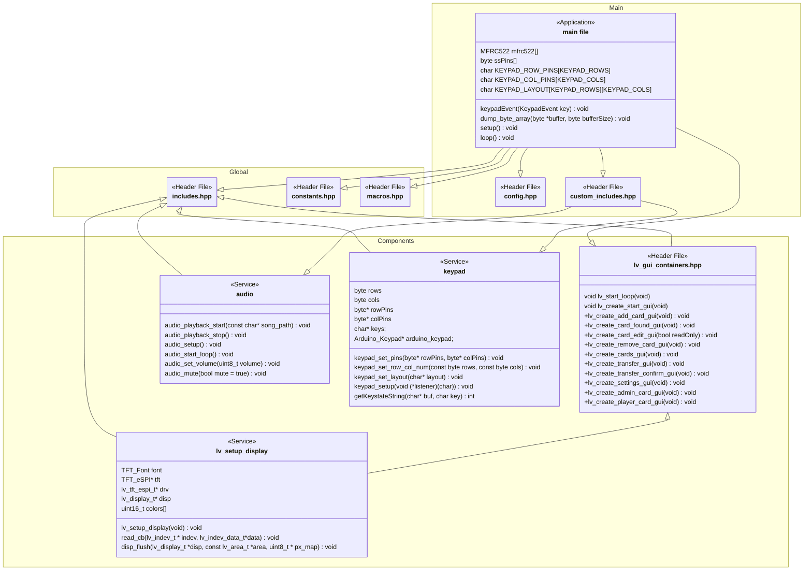

```mermaid
---
config:
    class:
        hideEmptyMembersBox: true
---

classDiagram 

`main file`--|> `config.hpp`
`main file`--|> `includes.hpp`
`main file`--|> `constants.hpp`
`main file`--|> `macros.hpp`
`main file`--|> `custom_includes.hpp`
`main file`--|> `lv_gui_containers.hpp`
  
`includes.hpp`<|-- `lv_gui_containers.hpp`
`includes.hpp`<|-- `lv_setup_display`
`lv_gui_containers.hpp`<|-- `lv_setup_display`

`includes.hpp`<|-- audio
`custom_includes.hpp`--|>audio


`includes.hpp`<|-- keypad
`custom_includes.hpp`--|>keypad
link `includes.hpp` "src\includes.hpp" "test"

namespace Global { 
    class `macros.hpp` {
        <<Header File>>
    }
    class `constants.hpp` {
        <<Header File>>
    }
    class `includes.hpp` {
        <<Header File>>
    }
}

namespace Components { 
    
    class `audio` {
        <<Service>>
        audio_playback_start(const char* song_path) void 
        audio_playback_stop() void 
        audio_setup() void 
        audio_start_loop() void 
        audio_set_volume(uint8_t volume) void 
        audio_mute(bool mute = true) void 
    }
    class `keypad` {
        <<Service>>
        byte rows
        byte cols
        byte* rowPins
        byte* colPins
        char* keys;
        Arduino_Keypad* arduino_keypad;

        keypad_set_pins(byte* rowPins, byte* colPins) void 
        keypad_set_row_col_num(const byte rows, const byte cols) void 
        keypad_set_layout(char* layout) void 
        keypad_setup(void (*listener)(char)) void 
        getKeystateString(char* buf, char key) int  
    } 
    class `lv_setup_display` {
        <<Service>>
        TFT_Font font
        TFT_eSPI* tft
        lv_tft_espi_t* drv
        lv_display_t* disp
        uint16_t colors[]
        lv_setup_display(void) void
        read_cb(lv_indev_t * indev, lv_indev_data_t*data) void
        disp_flush( lv_display_t *disp, const lv_area_t *area, uint8_t * px_map) void
    }
    class `lv_gui_containers.hpp`  {
        <<Header File>>
    
        void lv_start_loop(void)
    
        void lv_create_start_gui(void)

        +lv_create_add_card_gui(void) void
        +lv_create_card_found_gui(void) void
        +lv_create_card_edit_gui(bool readOnly) void
        +lv_create_remove_card_gui(void) void
        +lv_create_cards_gui(void) void
        +lv_create_transfer_gui(void) void
        +lv_create_transfer_confirm_gui(void) void
        +lv_create_settings_gui(void) void
        +lv_create_admin_card_gui(void) void
        +lv_create_player_card_gui(void) void
        
    }
}
 
namespace Main { 
    class `custom_includes.hpp` {
        <<Header File>>
    }

    class `main file` { 
        <<Application>>
        MFRC522 mfrc522[]
        byte ssPins[]

        char KEYPAD_ROW_PINS[KEYPAD_ROWS]
        char KEYPAD_COL_PINS[KEYPAD_COLS] 
        char KEYPAD_LAYOUT[KEYPAD_ROWS][KEYPAD_COLS]

        keypadEvent(KeypadEvent key) void
        dump_byte_array(byte *buffer, byte bufferSize) void
        setup() void
        loop() void
    } 
     
    class `config.hpp` {
        <<Header File>>
    
    }       
}

```