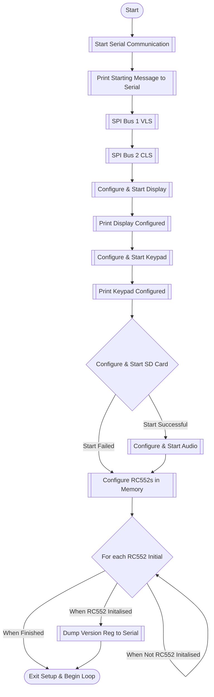

```mermaid
flowchart TB
	AA([Start])
	
	FS[[Start Serial Communication]]
	FSI[[Print Starting Message to Serial]]
	SPIB1[[SPI Bus 1 VLS]]
	SPIB2[[SPI Bus 2 CLS]]
	
	LVDS[[Configure & Start Display]] 
	FSLV[[Print Display Configured]]
	
	KPS[[Configure & Start Keypad]]
	FSKP[[Print Keypad Configured]] 
	
	SD{Configure & Start SD Card}
	
	AS[[Configure & Start Audio]]

	PRC[[Configure RC552s in Memory]]
	RC{For each RC552 Initial}
	FSRC[[Dump Version Reg to Serial]]

	AA-->FS
	FS-->FSI
	FSI-->SPIB1
	SPIB1-->SPIB2 
	SPIB2-->LVDS
	LVDS-->FSLV
	FSLV-->KPS
	KPS-->FSKP
	FSKP-->SD
	SD-->|Start Successful|AS
	SD-->|Start Failed|PRC
	AS-->PRC 
	PRC-->RC

	RC-->|When RC552 Initalised|FSRC
	RC-->|When Not RC552 Initalised|RC
	RC-->|When Finished|AB

	FSRC-->AB
	
	  
	AB([Exit Setup & Begin Loop])
	
```
